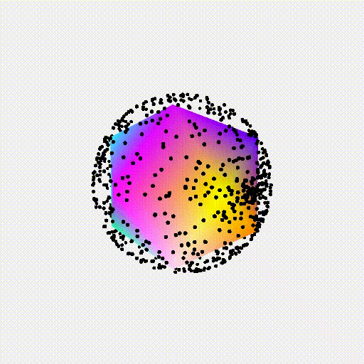

# WebGL Boilerplate

#### _This is all subject to change, but I generally don't write things up as often as I should so I'll leave this here for now, and update it eventually._

There are [plenty](https://github.com/greggman/twgl.js) of [other](https://github.com/skeeto/igloojs) [libraries](https://threejs.org/) out there which can do everything I need and more. But in an attempt to learn some of the intricacies of WebGL I decided to write my own mini-library to package up the core repetitive WebGL API calls. It mostly takes care of setting up the buffers for the geometries, setting up the attributes for the given shader program and also allows for "global" uniforms (uniforms applicable to all geometries for a particular program) and model specific uniforms to be updated seperately in an attempt to keep the draw loop efficient.

It is currently in a state where I can create shader programs and link them to relevent geometry and then call `draw()` on all the active programs. Below you can see 100,000 vertices on the unit sphere rendering without any sign of slowing down. This little demo was inspired by Chris Wellons aka [Null Program](https://nullprogram.com/blog/2013/06/10/). There are minimal calculations going on but still, nice to know:


Code for the above demo is as follows:

```javascript
import GL_BP from './GL_BP';
import RandomPointSphere from './randomPointSphere.js';
import Cube from './cube.js';
import './styles.css';
var pointsVert = require('./glsl/pointsVert.glsl');
var pointsFrag = require('./glsl/pointsFrag.glsl');
var linesFrag = require('./glsl/linesFrag.glsl');

window.onload = function main() {
    const GL = new GL_BP();
    // Create canvas of specified size and setup WebGL instance
    GL.init(512,512);
    GL.initShaderProgram('points', pointsVert, pointsFrag, 'POINTS');
    GL.initShaderProgram('lines', pointsVert, linesFrag, 'LINES');
    // Init scene for all programs so they receive the same 'global' uniforms
    GL.initBasicScene('points');
    GL.initBasicScene('lines');

    const rSphere = new RandomPointSphere(GL.gl, 100000);
    GL.linkProgram('points', rSphere);
    rSphere.rotate = { s:0.001, r:[1, 1, 0]};

    const uCube = new Cube(GL.gl, 'DEBUG');
    GL.linkProgram('lines', uCube);
    uCube.rotate = { s:0.001, r:[1, 1, 0]};

    function draw(now) {
        GL.draw(now);
        window.requestAnimationFrame(draw);
    }
    window.requestAnimationFrame(draw);
};
```

And then a simple example showing two different shader programs being run concurrently:



This is all part of some larger research which will hopefully result in some super responsive interactive particles systems, but we'll see..
